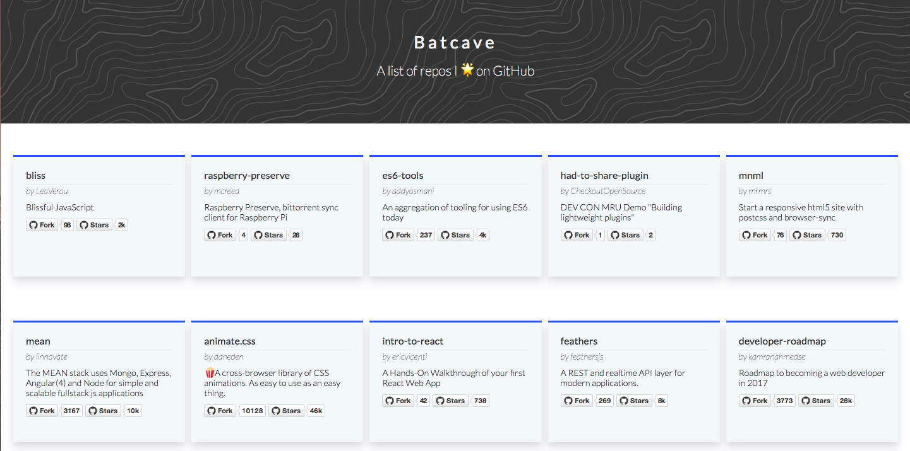

# Get all your starred repositories from GitHub

## Motivation

I find myself starring a lot of repositories on GitHub for some particular reasons :
I think the project is cool, I've used it and I liked it, I might need this later.

I wanted to make them more accessible for me when I'm looking for something from the lists.
I called it the `Batcave` because it has all the tools I might need.

Another reasons for me to build this is because I wanted to try `Styled-Components` 💅🏻.
I've read alot about it, and wanted to see for myself.

## Technologies used

- ReactJS
- Styled-Components
- GitHub Api